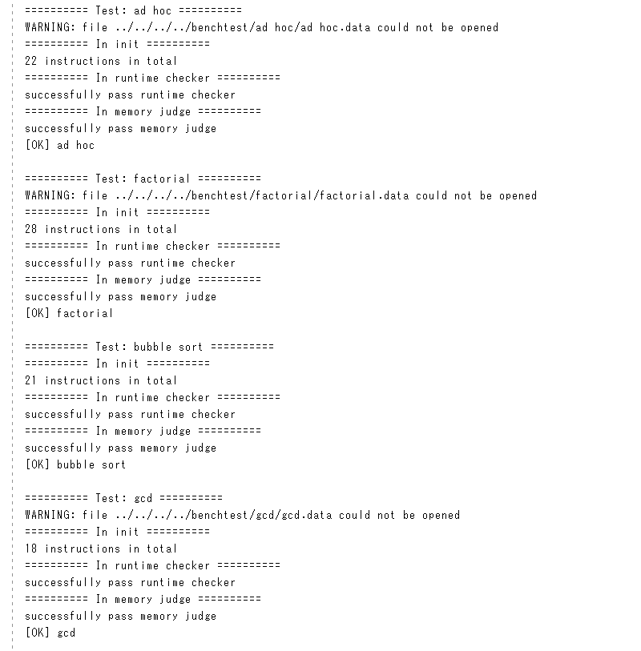
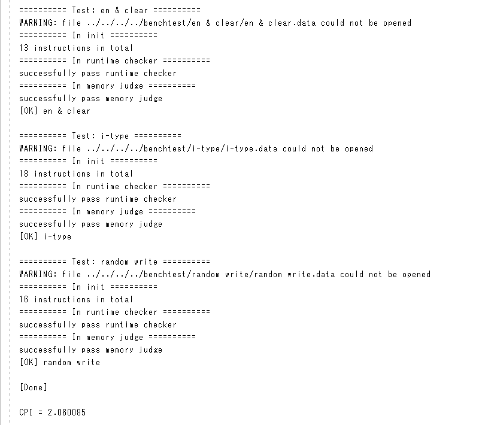

# Cache

32 位 256 Bytes 4 路组相联（参数可调节）高速缓存，使用 SystemVerilog 编写。[^1] [^2]

## 1. 参数


本图引自 *Computer Systems: A Programmer's Perspective Third Edition* [^2]。

本缓存在实现中默认使用 4 路组相联映射：总共 4 个组（Set），每组包含 4 个行（Line），每行保存 4 个字（word = 4 Bytes）。默认采用 LRU（Least Recently Used）替换策略，写内存时使用写回法（Write Back）。

在 [cache.svh](./src/cache/cache.svh) 中可调节以下参数：

- `CACHE_T`：地址中 tag 的位数 $t$，默认 $t = 26$
- `CACHE_S`：地址中 set index 的位数 $s$，对应组数即为 $2^s$，默认 $s = 2$
- `CACHE_B`：地址中 block offset 的位数 $b$，对应行的大小即为 $2^{b - 2}$ 个字（$2^b$ Bytes），默认 $b = 4$
- `CACHE_E`：每组的行数 $e$，默认 $e = 4$

要求 $t + s + b = 32$，即地址位数 $m$。其中通过调节参数 `CACHE_E`，即可相应实现 $e$ 路组相联映射。

在 [replace_controller.svh](./src/cache/replace_controller.svh) 中可调节以下参数：

- `REPLACE_MODE`：当前缓存替换策略 $mode$，目前实现了以下策略：
  - LRU：Least Recently Used，$mode = 0$
  - RR：Random Replacement，$mode = 1$
  - LFU：Least Frequently Used, $mode = 2$

## 2. 结构


### 2.1 Cache

Cache 负责输入 CPU 传来的地址、信号及数据，交由 Cache Controller 解析得到相应的控制信号，以控制读写 Set / 内存的数据，最终将 Set 的输出返还给 CPU。

代码见[这里](./src/cache/cache.sv)。

### 2.2 Cache Controller

Cache Controller 通过一个有限状态机（FSM, Finite State Machine）来决定当前所处的状态，随后利用组合逻辑得到 Set / 内存的控制信号及读写内存的地址（如果需要）。根据 CPU 输入的地址可以唯一决定需要操作的 Set，其余 Set 将被屏蔽。具体判断读写及返回哪一个 Line 的任务交给 Set 自行完成。

代码见[这里](./src/cache/cache_controller.sv)。

#### 2.2.1 FSM


本实现中的 FSM 包含 4 个状态：`INITIAL`、`WRITE_BACK`、`ONLY_WRITE`、`READ_MEM`。

- `INITIAL`：初始状态，即 Cache 命中的情况（`hit` 为 `1`）
  - 如果 Cache 未命中（`hit` 为 `0`），那么如果当前要操作的 Line 是 dirty 的（`dirty` 为 `1`，表示缓存被修改过，但还未写回内存），则切换到 `WRITE_BACK` 状态写回新数据，否则（`dirty` 为 `0`）切换到 `READ_MEM` 状态从内存读取数据
  - 这里有一个特例，当 CPU 需要**读**一个 dirty 的 Line 时（`write_en` 为 `0`、`dirty` 为 `1`），无论是否命中，FSM 都将切换到 `ONLY_WRITE` 状态将 dirty line 写回内存
- `WRITE_BACK`：写回状态，将 dirty line 写回内存
  - 阻塞 Cache 到写入完成后（`ready` 为 `1`）切换到 `READ_MEM` 状态，默认需要等待 4 个时钟周期（取决于 Line 的大小 `LINE_SIZE`，由参数 `CACHE_B` 决定）
  - 计时的工作交给 Counter 完成（计数器从 0 开始计时，需要启用时传入 `wait_rst` 信号刷新），实现中 `ready` 信号由 `wait_rst` 信号表示，其值为 `wait_time == WAIT_TIME - 1`，其中 `WAIT_TIME` 即预设的等待时间，默认取值为 `LINE_SIZE`（参数可在 [cache_controller.sv](./src/cache/cache_controller.sv) 中调节，要求值不能低于 `LINE_SIZE`）
- `ONLY_WRITE`：只写回状态，基本同 `WRITE_BACK` 状态，区别是写入完成后直接返回 `INITIAL` 状态，而不进入 `READ_MEM` 状态，因为此时内存和 Cache 的数据是一致的，也不需要替换 Line，因此不需要读取内存；本次测试中，引入 `ONLY_WRITE` 状态的这项优化将 CPI 降低了 `0.04`
- `READ_MEM`：读内存状态，从内存读取数据到缓存
  - 阻塞 Cache 到读入完成后（`ready` 为 `1`）切换到 `INITIAL` 状态，默认需要等待 4 个时钟周期

#### 2.2.2 Controller Logic

根据 FSM 提供的当前状态，Cache Controller 输出 Set / 内存的控制信号，如下所示：

| signal       | INITIAL        | WRITE_BACK | ONLY_WRITE | READ_MEM | Disabled |
|:------------:|:--------------:|:----------:|:----------:|:--------:|:--------:|
| write_en     | write_en & hit | 0          | 0          | 1        | 0        |
| update_en    | 0              | 1          | 1          | 1        | 0        |
| set_valid    | write_en & hit | 1          | 1          | wait_rst | 0        |
| set_dirty    | write_en & hit | 0          | 0          | 0        | 0        |
| strategy_en  | 1              | 0          | 0          | 1        | 0        |
| offset_sel   | 1              | 0          | 0          | 0        | 0        |
| mem_write_en | 0              | 1          | 1          | 0        | 0        |

各控制信号的含义如下：

- `write_en` 即是否对 Line 进行写操作，同时设置 dirty 位为 `1`
- `update_en` 即是否对 Line 的状态进行更新，即分别更新 valid 和 dirty 位为 `set_valid` 和 `set_dirty`，其中对 dirty 位的更新将覆盖 write_en 的操作
- `set_valid` 即是否将当前 Line 设置为 valid，此后如果此 Line 的 tag 和访问地址的 tag 字段匹配，就会返回 Cache 命中
- `set_dirty` 即是否将当前 Line 设置为 dirty
- `strategy_en` 即是否启用 Replace Controller，用于决定替换掉哪一个 Line，如果未启用则 Replace Controller 保持之前的输出
- `offset_sel` 为 `1` 时，Cache 与 CPU 交互，访问 Line 的块偏移量（block offset）由 CPU 输入的地址提供，写入 Line 的数据（如果需要）为 CPU 输入的数据；`offset_sel` 为 `0` 时，Cache 与内存交互，访问 Line 的块偏移量由当前访问的内存地址提供，写入 Line 的数据为从内存读取的数据
- `mem_write_en` 即是否对内存进行写操作

### 2.3 Set

得到控制信号的 Set 需要判断读写及返回哪一个 Line 的数据。本实现中，每个 Line 自行检查 tag 是否匹配，并返回是否命中，命中的 Line 将同时返回对应块的数据。如果存在命中的 Line，Set 就返回这个 Line 的数据，否则交由 Replace Controller 决定接下来应当写入（覆盖）哪一个 Line。

代码见[这里](./src/cache/set.sv)。

### 2.4 Replace Controller

Replace Controller 根据当前各 Line 的 valid 和 hit 情况决定并输出接下来应当替换的 Line。当 `strategy_en` 为 `1` 时启用，否则 Replace Controller 将保持之前的输出。

根据参数 `REPLACE_MODE`，Replace Controller 决定当前的缓存替换策略。若 Cache 未命中，先检查如果有 Line 不是 valid 的，则替换其中一个，否则根据如下策略进行替换：

- LRU：维护一个 `recent_access[SET_SIZE]` 数组（其中 `SET_SIZE` 为每个 Set 的 Line 数），初始状态全 `0`；每当 Cache 命中时，命中 Line 的索引 `i` 对应的 `recent_access[i]` 置 `0`，其余索引对应的值加 `1`；若 Cache 未命中且所有 Line 均为 valid，则替换索引 `i` 对应的 `recent_access[i]` 最大的 Line
- RR：若 Cache 未命中且所有 Line 均为 valid，则随机替换一个 Line，使用了 SystemVerilog 的 `$urandom` 系统函数
- LFU：维护一个 `access_count[SET_SIZE]` 数组，初始状态全 `0`；每当 Cache 命中时，命中 Line 的索引 `i` 对应的 `access_count[i]` 加 `1`；若 Cache 未命中且所有 Line 均为 valid，则替换索引 `i` 对应的 `access_count[i]` 最小的 Line

因为将替换策略单独放置在一个模块中，要新增其他策略也十分方便。这里仅作为例子额外实现了 2 个策略，实际上其他一些策略也很容易实现，有兴趣欢迎提交 Pull Request。

代码见[这里](./src/cache/replace_controller.sv)。

## 3. 一些改动

本 Cache 的实现基于之前实现的 Pipeline MIPS CPU，这里注明所作的一些改动。

因为 Cache 未命中时需要读写内存，在此期间 CPU 不能访问 Cache，否则会发生数据冲突，此时需要 stall 整个流水线（其实有些情况下并不需要 stall，例如 dcache 处于 `ONLY_WRITE` 阶段，而 CPU 暂时不需要访问 dcache 时，可以等 CPU 需要访存时再 stall，可见这里存在优化空间）。本实现中，icache 的 stall 信号为 `istall`，dcache 的 stall 信号为 `dstall`，用于使 icache 和 dcache 同时至多只有其一访问内存，而 CPU 只有在二者都没有 stall 时才能继续运行。为防止二者互锁，对这两个信号进行了互斥处理。

```verilog {.line-numbers}
assign istall = ~dstall & dcen & ~dhit;
assign dstall = ~istall & ~ihit;
```

其中，`ihit`、`dhit` 分别表示 icache、dcache 命中，`dcen` 表示 CPU 需要读写内存。因此这里对 mips 的端口进行了一些修改，新增了输入端口 ihit、dhit 和输出端口 dcen。

```verilog {.line-numbers}
assign dcen = memwrite | mem_to_reg_m;
// assign stall_cache = ~ihit | (dcen & ~dhit);
```

本来 `ihit`、`dhit`、`dcen` 还要用于决定是否 stall 流水线，但这里直接通过屏蔽 CPU 时钟实现了，就无需另外改动 mips 的代码。

在原测试程序中，icache 和 dcache 共用一个 stall 信号，这会使得 CPU 直接卡死，因此这里修改了测试程序的代码，使用了以上实现（即 icache 和 dcache 分别使用自己的 stall 信号）。

此外，由于新增的 random write 样例需要访问 128 位 dmem，因此将 dmem 的内存大小作了对应调整。

## 4. 样例测试

### 4.1 测试结果






### 4.2 测试环境

- OS: Windows 10 Version 2004 (OS Build 19041.264)
- Using Vivado v2019.1 (64-bit)

### 4.3 测试分析

这里 CPI 较原 Pipeline MIPS CPU 升高是正常现象，因为 Cache 引入了 4 个时钟周期的 miss penalty，更加符合实际情况（虽然实际情况 miss penalty 还会更大）。在不同的参数下进行测试，各替换策略的 CPI 如下所示：

| Policy | CPI #1   | CPI #2   | CPI #3   |
|:------:|:--------:|:--------:|:--------:|
| LRU    | 1.997842 | 1.997646 | 2.004709 |
| RR     | 1.990779 | 1.995880 | 2.004709 |
| LFU    | 2.015499 | 2.017069 | 2.004709 |

1. 256 Bytes 4 路组相联映射（默认）：$(t,s,b,e) = (26,2,4,4)$
2. 256 Bytes 2 路组相联映射：$(t,s,b,e) = (25,3,4,2)$
3. 256 Bytes 直接映射：$(t,s,b,e) = (24,4,4,1)$

可见在缓存大小不变的情况下，缓存效果大体上呈现 RR ≈ LRU > LFU 的趋势（直接映射下替换策略无意义，在此忽略），而路数的影响似乎并不大。当然这也和测试样例的设计有关，这里样本本身也很少，只是作一个粗略的估计。

如果将缓存扩大一倍，同时相应地路数也增加一倍呢？

| Policy | CPI #1   | CPI #2   | CPI #3   | CPI #4   |
|:------:|:--------:|:--------:|:--------:|:--------:|
| LRU    | 1.799882 | 1.797920 | 1.797920 | 1.797920 |
| RR     | 1.799882 | 1.797920 | 1.797920 | 1.797920 |
| LFU    | 1.799882 | 1.797920 | 1.797920 | 1.797920 |

1. 512 Bytes 8 路组相联映射：$(t,s,b,e) = (26,2,4,8)$
2. 512 Bytes 4 路组相联映射：$(t,s,b,e) = (25,3,4,4)$
3. 512 Bytes 2 路组相联映射：$(t,s,b,e) = (24,4,4,2)$
4. 512 Bytes 直接映射：$(t,s,b,e) = (23,5,4,1)$

缓存太大了……当前测试样例体现不出差距，好吧。不过至少说明扩大缓存对于缓存效果的提升还是很明显的，毕竟需要替换缓存的次数减少了。

如果将缓存缩小一半，同时相应地路数也减少一半呢？

| Policy | CPI #1   | CPI #2   |
|:------:|:--------:|:--------:|
| LRU    | 2.128311 | 2.112811 |
| RR     | 2.108495 | 2.112811 |
| LFU    | 2.113008 | 2.112811 |

1. 128 Bytes 2 路组相联映射：$(t,s,b,e) = (26,2,4,2)$
2. 128 Bytes 直接映射：$(t,s,b,e) = (25,3,4,1)$

顺位又变成 RR ≈ LFU > LRU 了，可能是因为 LRU 本身对长循环不太友好，因为最近访问过的数据反而不容易再被访问，程序更倾向于访问旧数据 [^3]。于是当缓存太小的时候，这个问题就暴露了出来。

总的来说，RR 策略容易实现，且效果稳定良好，反倒是一个不错的选择，比较意料之外。

## 5. 贡献者

- [**Hakula Chen**](https://github.com/hakula139)<[i@hakula.xyz](mailto:i@hakula.xyz)> - Fudan University

## 6. 许可协议

This project is licensed under the GNU General Public License v3.0 - see the [LICENSE](../LICENSE) file for details.

## 7. 参考资料

[^1]: David A. Patterson, John L. Hennessy: *Computer Organization and Design Fifth Edition*  
[^2]: Randal E. Bryant, David R. O'Hallaron: *Computer Systems: A Programmer's Perspective Third Edition*  
[^3]: [Cache replacement policies - Wikipedia](https://en.wikipedia.org/wiki/Cache_replacement_policies)
