# Pipeline MIPS CPU

32 位流水线 MIPS 指令集 CPU，使用 SystemVerilog 编写。[^1]

## 1. MIPS 指令集

同单周期，详见[单周期实验报告](../Single-Cycle/README.md)。

## 2. 部件构成及分析

### 2.0 总览

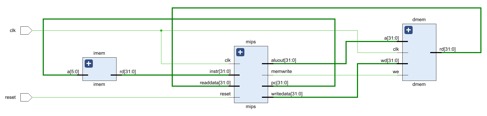

如图所示为流水线 MIPS CPU 的整体概览，与单周期 MIPS CPU 是一样的，区别在于 CPU 核心 mips 的实现。以下将仅介绍与单周期不同的部分，其余请参见单周期实验报告。

### 2.1 mips

本流水线 CPU 的实现中，将 datapath 按照流水线的 5 个阶段划分为了 5 个模块（Fetch, Decode, Execute, Memory, Writeback），并增加了一个用于处理冲突的冲突单元（Hazard Unit）。其中各模块的作用如下 [^1]：

- Fetch：取指令阶段，从指令存储器中读取指令
- Decode：译码阶段，从寄存器文件中读取源操作数，并对指令译码以产生控制信号
- Execute：执行阶段，使用 ALU 执行计算
- Memory：存储器阶段，读写数据存储器
- Writeback：写回阶段，按需将结果写回到寄存器文件
- Hazard Unit：冲突单元，用于发现及处理数据冲突和控制冲突

方便起见，将 Fetch 阶段和 Decode 阶段之间的流水线寄存器命名为 decode_reg，并置于 Fetch 模块中，其余流水线寄存器同理。

具体模块功能分析将在下文阐述。这里 mips 的作用就是将这些模块连接起来，其中相同名称的端口即连通。除此以外特殊的几条连线如下所示：

- mips 读端口 reset, instr, readdata 分别与 rst, instr_f, read_data_m 连通
- mips 写端口 aluout, memwrite 分别与 alu_out_m, mem_write_m 连通

了解了以上连接规则后，展示 mips 的完整总览图就不那么必要。比起大而繁乱的连线总览图，直接看代码甚至都更为直观。

代码见[这里](./src/mips.sv)。

### 2.2 fetch

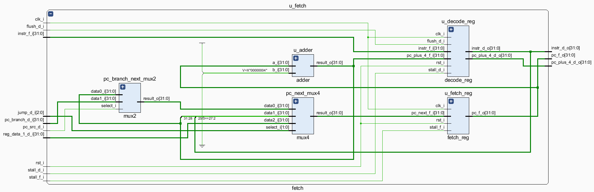

Fetch 阶段，通过 pc_f 输出指令地址 `pc` 到 imem，通过 instr_f 从 imem 读入指令 `instr`，存储到流水线寄存器 decode_reg 中，在下一个时钟上升沿到达时从 instr_d 输出。

此外，本阶段还需要完成 PC 的更新。`pc_next`（新的 PC 值）的选择逻辑同单周期实验报告第 2.8 节所述，这里就不再赘述了。需要注意的是 Fetch 阶段需要用到一些 Decode 阶段的数据，也就是上一条指令计算得到的相对寻址地址 `pc_branch_d`、用于指令 jr 跳转的地址 `src_a_d`、指令解析得到的 `pc_src_d`, `jump_d` 信号，用来确定 pc_next 的值。

在需要解决冲突的情况下，通过 `stall_f`, `stall_d`, `flush_d` 信号决定是否保持（stall）或清空（flush）对应流水线寄存器保存的数据，其中 `stall_f` 为 `1` 时保持当前 PC 值不更新，`stall_d` 为 `1` 时保持当前 decode_reg 的数据不更新，`flush_d` 为 `1` 时清空 decode_reg 的数据。具体这些信号在何时为何值，将在 hazard_unit 章节详细阐述，下同。

代码见[这里](./src/pipeline_stages/fetch.sv)。

#### 2.2.1 fetch_reg

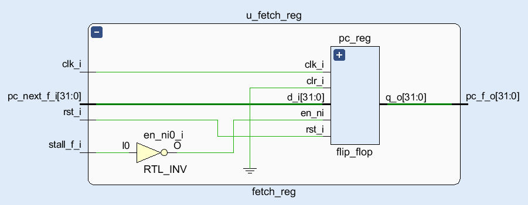

Fetch 阶段流水线寄存器。结构很简单，就是将 PC 寄存器 pc_reg 封装了一下。但相较于单周期版本的 flip_flop，流水线版本做了一些调整。

代码见[这里](./src/pipeline_registers/fetch_reg.sv)。

##### 2.2.1.1 flip_flop


这里只说与单周期版本的区别，其余请参见单周期实验报告第 2.10 节。

首先增加了一个清零信号 CLR，当 CLR 为 `1` 时，将保存的数据同步清零（RST 为异步清零），用于 `flush` 信号。尽管这里 fetch_reg 并不需要用到，但其他流水线寄存器可能会需要，这里是出于部件复用的考虑。其次增加了一个**低电平**有效的保持信号 EN，当 EN 为 `0` 时，保持数据不变。对于 fetch_reg 来说，其值即 `~stall_f`。

代码见[这里](./src/flip_flop.sv)。

#### 2.2.2 decode_reg

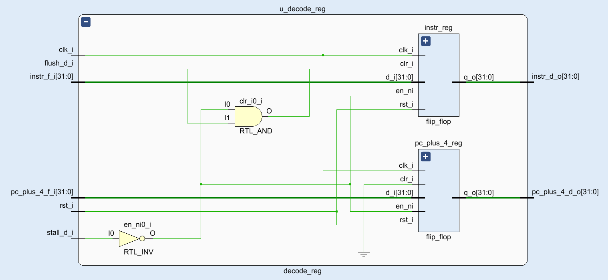

Fetch 阶段和 Decode 阶段之间的流水线寄存器。中转一下 `instr` 和 `pc_plus_4`。为什么需要用触发器中转数据？因为流水线上需要同时跑多条指令（这里是 5 条），需要控制每个阶段各自只在执行一条指令。

这里 instr_reg 的 CLR 信号为 `~stall_d & flush_d`，是为了使 `stall_d` 和 `flush_d` 信号互斥，且强制 `stall_d` 的优先级更高（当 `stall_d` 为 `1` 时，`flush_d` 无效，不允许清零），否则当两者同时为 `1` 时会导致错误（因为在触发器的实现中，`flush` 的优先级更高，这将导致指令丢失）。pc_plus_4_reg 不需要清零，因此 CLR 信号恒为 `0`。

代码见[这里](./src/pipeline_registers/decode_reg.sv)。

### 2.3 decode

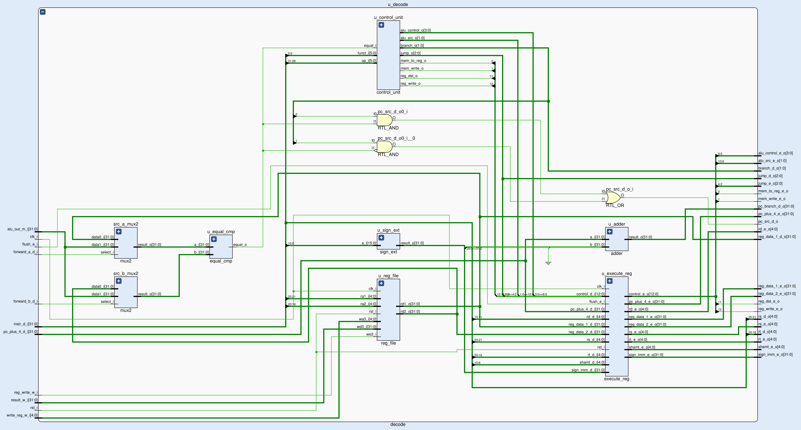

图比较大，如果看不清字可以直接查看[原图](./assets/decode.png)。

Decode 阶段，读入指令 `instr_d`，由控制单元 control_unit 解析，决定各个控制信号。此外，本阶段还需要完成相对寻址地址 `pc_branch_d` 的计算，然后交给下一条指令的 Fetch 阶段。

作为**静态分支预测**，本阶段新增了比较器 equal_cmp，用来比较从寄存器中读出的两个数 `src_a`, `src_b` 是否相等，其作用是将指令 beq, bne 的比较过程提前到 Decode 阶段，提前得到 `pc_src` 信号，从而提高效率。这里需要用到 Memory 阶段的数据 `alu_out_m` 以应对数据冒险，`src_a`, `src_b` 取值的选择由 `forward_a_d`, `forward_b_d` 信号控制。

在实现中，将寄存器文件 reg_file 放在了 decode 模块里，因此 Writeback 阶段的寄存器写入操作也将在这里完成。所以这里需要用到一些 Writeback 阶段的数据，也就是 `reg_write_w` 信号、目标寄存器 `write_reg_w`、写入数据 `result_w`。

在需要解决冲突的情况下，通过 `stall_e`, `flush_e` 信号决定是否保持或清空 execute_reg 保存的数据。

代码见[这里](./src/pipeline_stages/decode.sv)。

### 2.3.1 control_unit

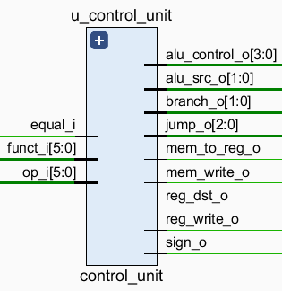

流水线版本中，control_unit 新增了一个控制信号 `sign`，用于控制对立即数进行符号扩展还是无符号扩展，解决了新增测试样例 i-type 中遇到的一些问题。此外为了调试方便，本实现中将控制信号中的无关项 `x` 都改成了 `0`，其余同单周期版本。主译码器中，新增信号的真值表如下：

| 指令   | opcode | sign |
|:------:|:------:|:----:|
| R-type | 000000 | 0    |
| addi   | 001000 | 1    |
| andi   | 001100 | 0    |
| ori    | 001101 | 0    |
| slti   | 001010 | 1    |
| lw     | 100011 | 1    |
| sw     | 101011 | 1    |
| j      | 000010 | 0    |
| jal    | 000011 | 1    |
| jr     | 001000 | 0    |
| beq    | 000100 | 1    |
| bne    | 000101 | 1    |

代码见[这里](./src/control_unit.sv)。

#### 2.3.2 equal_cmp

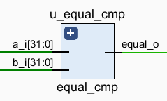

32 位比较器，用于比较两个数是否相等。

使用时读入 A 和 B，若 A 和 B 相等则从 EQUAL 输出 `1`。

代码见[这里](./src/utils.sv)。

#### 2.3.3 extend

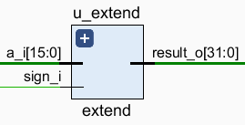

扩展模块的作用是将 16 位的立即数扩展至 32 位。单周期版本中默认使用符号扩展，流水线版本中可以自行选择。

使用时从 A 读入待扩展的数据，从 RESULT 输出扩展后的数据。当 SIGN 为 `1` 时使用符号扩展，为 `0` 时使用无符号扩展。

代码见[这里](./src/utils.sv)。

#### 2.3.4 reg_file


流水线版本中，寄存器文件调整为在时钟**下降沿**将数据写入，其余同单周期版本。

代码见[这里](./src/reg_file.sv)。

#### 2.3.5 execute_reg

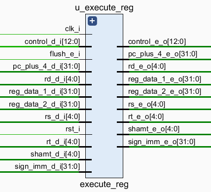

Decode 阶段和 Execute 阶段之间的流水线寄存器。中转一下 `control`, `pc_plus_4`, `reg_data_1`, `reg_data_2`, `rs`, `rt`, `rd`, `shamt`, `ext_imm`，其中：

- `control` 是控制信号 `reg_write`, `reg_dst`, `alu_src`, `alu_control`, `jump`, `mem_write`, `mem_to_reg` 的集合，这样代码写起来方便一点
- `pc_plus_4` 是 `PC + 4` 的值；由于指令 jal 在之后还需要用到这个值，因此需要继续传到 Execute 阶段
- `reg_data_1`, `reg_data_2` 是 reg_file 读出的两个值
- `rs`, `rt`, `rd`, `shamt` 分别是 `instr_d[25:21]`, `instr_d[20:16]`, `instr_d[15:11]`, `instr_d[10:6]`
- `ext_imm` 是 32 位扩展后的 `instr_d[15:0]`

结构及原理同 decode_reg，不再赘述，下同。

代码见[这里](./src/pipeline_registers/execute_reg.sv)。

### 2.4 execute

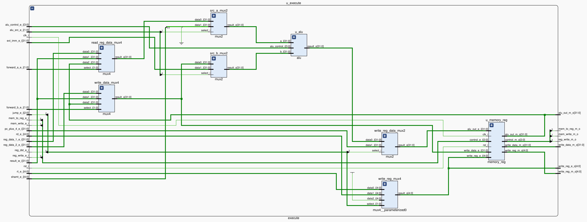

图比较大，如果看不清字可以直接查看[原图](./assets/execute.png)。

Execute 阶段，对操作数 `src_a`, `src_b` 使用 ALU 执行计算。在单周期版本的基础上，新增了两个 mux4 用于转发逻辑。这里需要用到 Memory 阶段的数据 `alu_out_m` 和 Writeback 阶段的数据 `result_w` 以应对数据冒险，`read_reg_data`, `write_data`（分别为通常情况下的 `src_a`, `src_b`）取值的选择由 `forward_a_e`, `forward_b_e` 信号控制。

代码见[这里](./src/pipeline_stages/execute.sv)。

#### 2.4.1 memory_reg

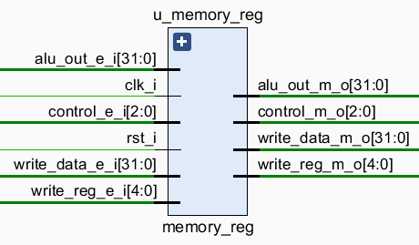

Execute 阶段和 Memory 阶段之间的流水线寄存器。中转一下 `control`, `alu_out`, `write_data`, `write_reg`，其中：

- `control` 是控制信号 `reg_write`, `mem_write`, `mem_to_reg` 的集合
- `alu_out` 通常是 ALU 的计算结果，可能作为写入 dmem 的目标地址，也可能作为之后需要写入 reg_file 的数据，之后由传给 Memory 阶段的控制信号控制；对于指令 jal，则是之前传下来的 `pc_plus_4`，因为和 `alu_out` 要走的路径一致，借路继续传到 Memory 阶段
- `write_data` 是需要写入 dmem 的数据
- `write_reg` 是之后写入 reg_file 的目标寄存器；对于指令 jal，则为 `$ra`

代码见[这里](./src/pipeline_registers/memory_reg.sv)。

### 2.5 memory

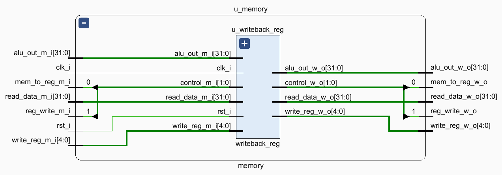

Memory 阶段，当 `mem_write` 为 `1` 时，在 dmem 的目标地址 `alu_out` 存储需要写入的数据 `write_data`。不过实际上这件事情并不是在 memory 模块内完成的，因为 dmem 在 mips 外面。因此实现中是在 execute 模块通过 mem_write_m, alu_out_m, write_data_m 将 `mem_write`, `alu_out`, `write_data` 直接输出到 dmem，在下一个时钟上升沿到达时（即 Memory 阶段）写入 dmem。memory 模块内则是通过 read_data_m 从 dmem 读入数据 `read_data`。

代码见[这里](./src/pipeline_stages/memory.sv)。

#### 2.5.1 writeback_reg

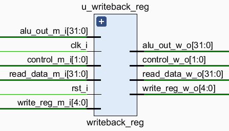

Memory 阶段和 Writeback 阶段之间的流水线寄存器。中转一下 `control`, `alu_out`, `read_data`, `write_reg`，其中：

- `control` 是控制信号 `reg_write`, `mem_to_reg` 的集合
- `read_data` 是可能需要写入 reg_file 的数据

代码见[这里](./src/pipeline_registers/writeback_reg.sv)。

### 2.6 writeback

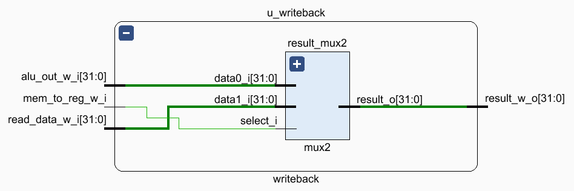

Writeback 阶段，由 `mem_to_reg` 信号控制 result_mux2 选择写入 reg_file 的数据为 `alu_out` 还是 `read_data`。

写入逻辑放在了 decode 模块，参见第 2.3 节。

代码见[这里](./src/pipeline_stages/writeback.sv)。

### 2.7 hazard_unit

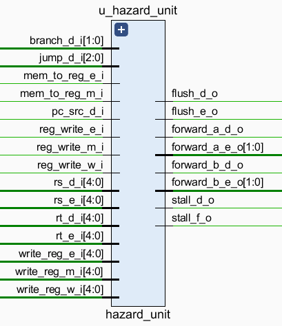

冲突单元根据传入的各阶段寄存器和控制信号，检查是否存在数据冲突或控制冲突，并输出相应的控制信号（forward, stall, flush）以处理冲突。

代码见[这里](./src/hazard_unit.sv)。

#### 2.7.1 数据冲突

当一条指令依赖于另一条指令的结果，而此结果还未写入寄存器文件时，将发生写后读（Read After Write, RAW）数据冲突。解决 RAW 冲突的方法：如果此时这个结果已经在某个阶段被计算出来，那么可以使用重定向（forwarding）将数据转发过来；否则需要阻塞（stall）流水线直到结果可用。需注意，`$0` 寄存器硬连接为 `0`，因此源寄存器为 `$0` 时不需要进行转发或阻塞。以下将阐述这两种方法的具体实现。

##### 2.7.1.1 使用重定向解决冲突

当 Execute 阶段的源寄存器 `$rs` 或 `$rt` 与 Memory 阶段或 Writeback 阶段（即前两条指令）的写入目标寄存器 `write_reg` 相同，且其 `reg_write` 信号为 `1` 时（即需要写入目标寄存器），重定向对应的 `src_a` 或 `src_b`。以 `$rs` 的情况为例（`$rt` 同理），重定向逻辑如下：

```verilog {.line-numbers}
if (rs_e_i && rs_e_i == write_reg_m_i && reg_write_m_i) begin
  forward_a_e_o <= 2'b10;
end else if (rs_e_i && rs_e_i == write_reg_w_i && reg_write_w_i) begin
  forward_a_e_o <= 2'b01;
end else begin
  forward_a_e_o <= 2'b00;
end
```

其中当 `forward_a_e` 为 `10` 时，Memory 阶段转发的数据是 `alu_out_m`；当 `forward_a_e` 为 `01` 时，Writeback 阶段转发的数据是 `result_w`。

需注意这里 Memory 阶段的优先级高于 Writeback 阶段，因为 Memory 阶段的指令后执行，包含的数据更新。

##### 2.7.1.2 使用阻塞解决冲突

对于指令 lw，因为它有两个周期的延迟，意味着其他指令至少要到两个周期后才能使用它的结果。如果指令 lw 后紧接着一个使用其结果的指令，则使用重定向无法解决这种冲突，此时需要阻塞流水线。现实中，编译器会针对这种情况做一定的优化，通过调整指令顺序，在发生数据冲突的两条指令间插入一条无关指令，从而避免这种冲突。

当 Execute 阶段正在执行的指令是 lw（此时 `mem_to_reg` 信号为 `1`），且 Decode 阶段的任一源操作数 `$rs` 或 `$rt` 与 Execute 阶段的目的寄存器 `$rt` 相同，阻塞 Decode 阶段直到源操作数准备好。阻塞逻辑如下：

```verilog {.line-numbers}
assign lw_stall = (rs_d_i == rt_e_i || rt_d_i == rt_e_i) && mem_to_reg_e_i;

assign flush_e_o = lw_stall;
assign stall_d_o = flush_e_o;
assign stall_f_o = stall_d_o;
```

这里阻塞 Decode 阶段的同时也要阻塞 Fetch 阶段，并且刷新（flush）Execute 阶段，产生气泡。

#### 2.7.2 控制冲突

在取下一条指令时还不能确定指令地址时，将发生控制冲突，即处理器不知道应该取哪条指令。解决控制冲突的方法：预测下一条指令地址，如果预测错误则刷新流水线。目前的实现中使用的是静态分支预测，事实上动态分支预测可以获得更高的性能。

然而，静态分支预测将导致新的 RAW 冲突，因此需要再次使用第 2.7.1 节解决数据冲突时的两种方法。

##### 2.7.2.1 使用重定向解决冲突

如果指令的结果在 Writeback 阶段，则它将在前半周期写入寄存器，而在后半周期进行读操作，此时不会产生冲突。如果指令的结果在 Memory 阶段，则可以将它重定向回 Decode 阶段的 equal_cmp。类似第 2.7.1.1 节，以 `$rs` 的情况为例（`$rt` 同理），重定向逻辑如下：

```verilog {.line-numbers}
assign forward_a_d_o = rs_d_i && rs_d_i == write_reg_m_i && reg_write_m_i;
```

##### 2.7.2.2 使用阻塞解决冲突

如果指令的结果在 Execute 阶段，或者指令 lw 的结果在 Memory 阶段，则需要阻塞流水线。类似第 2.7.1.2 节，阻塞逻辑如下：

```verilog {.line-numbers}
assign branch_stall = (branch_d_i || jump_d_i[1])
    && (reg_write_e_i && (rs_d_i == write_reg_e_i || rt_d_i == write_reg_e_i)
    || mem_to_reg_m_i && (rs_d_i == write_reg_m_i || rt_d_i == write_reg_m_i));

assign stall_d_o = lw_stall || branch_stall;
assign flush_e_o = stall_d_o;
assign stall_f_o = stall_d_o;
```

其中，`jump_d[1]` 信号为 `1` 时表示当前指令为 jr。

##### 2.7.2.3 清除无效数据

当发生跳转时，需要清除跳转指令之后多读的一条无效指令，即刷新 Decode 阶段，产生气泡。刷新逻辑如下：

```verilog {.line-numbers}
assign flush_d_o = pc_src_d_i || jump_d_i;
```

## 3. 样例测试

### 3.1 测试结果

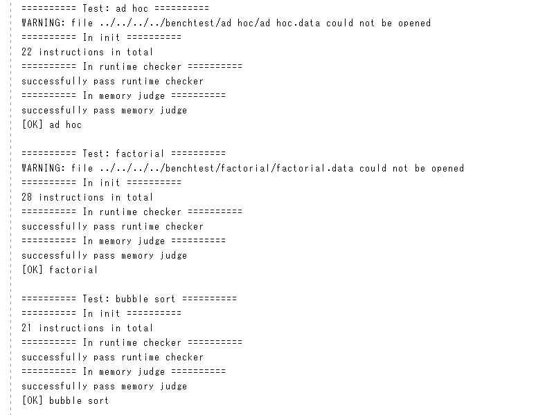

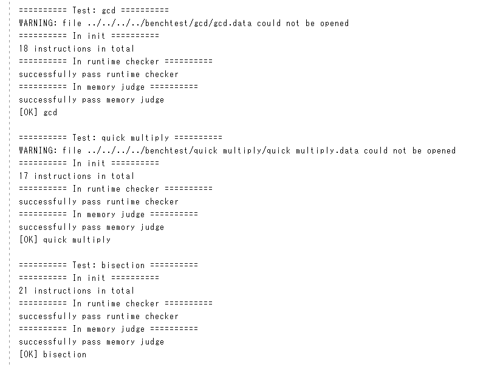

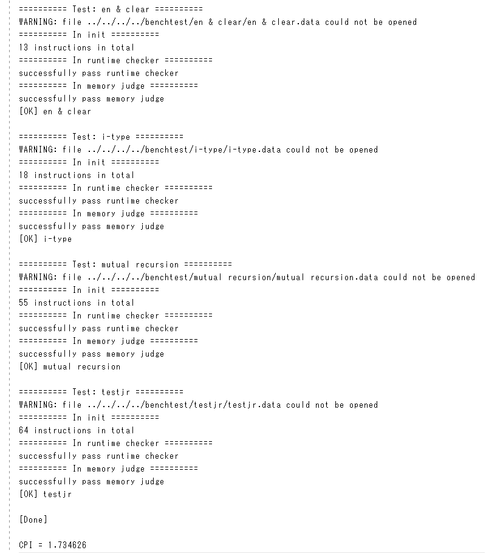

### 3.2 测试环境

- OS: Windows 10 Version 2004 (OS Build 19041.207)
- Using Vivado v2019.1 (64-bit)

### 3.3 测试分析

可以看到本实现的 CPI 偏高，经观察发现主要是 bubble sort 的样例 CPI 较高（达到了 `1.8`），其余样例的 CPI 普遍在 `1.2` 级别。分析原因可能在于其中的循环较多，而静态分支预测对循环并不友好，跳转指令的 CPI 通常为 `2`。如果引入动态分支预测，则跳转指令的 CPI 将更接近 `1`，从而大幅降低整体 CPI。

由于时间有限，未能有机会实现动态分支预测，因此仅在此做理论上的分析。

## 4. 贡献者

- [**Hakula Chen**](https://github.com/hakula139)<[i@hakula.xyz](mailto:i@hakula.xyz)> - Fudan University

## 5. 许可协议

This project is licensed under the GNU General Public License v3.0 - see the [LICENSE](../LICENSE) file for details.

## 6. 参考资料

[^1]: David Money Harris, Sarah L. Harris: *Digital Design and Computer Architecture Second Edition*
